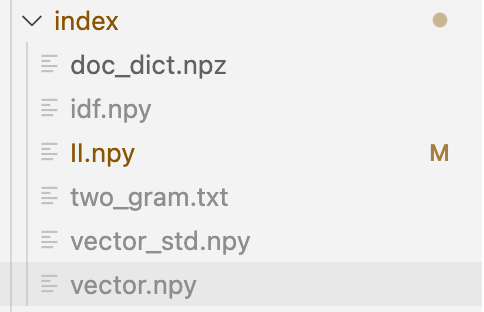

## <center> Web Search Engine 使用手册

### <center> Group 5

### 一、下载与运行

使用web search engine的命令如下

```bash
git clone ...
cd $WEBHOME/src 
python console.py
```

- 该应用目前支持Linux和macOS下运行
- 请事先安装使用的库（如numpy）以及模型（如wordnet）
- 在运行`console.py`之前，请确认`index`目录下有如下文件：



如果文件不全，请将index目录删除，重新运行`console.py`，应用将生成上述文件。

### 二、操作介绍

运行`console.py`后一段时间，程序读取创建/读取index完毕，进入开始界面。


此处展示了目前的search  mode，支持的指令等信息。如果想要重新展示导航栏，请输入

```bash
:info
```

会重新展示导航栏。

应用接收的输入有两种，第一种为command，以`:`开头，`:`后为执行的命令。另外一种为search，不以任何字符开头，用户直接输入即为搜索内容

下面介绍各种命令

#### `:switch`

切换搜索模式，具体使用在下面展示

#### `:open`

打开特定功能，如`open extend`为开启同义词扩展功能


#### `:close`

关闭特定功能，与open相同


#### `:top`

修改topk搜索中展示的个数


#### `:clr`

清屏，与bash中clear命令相同。

#### `:exit`

退出程序

### 三、搜索使用方法与示例

#### 布尔查询

切换模式为 bool search，输入搜索的单词，将bool运算符（NOT，AND，OR）大写。

```bash
:switch bool
NOT rise AND fall
```


搜索返回满足结果的文档名，如果文档较多，则会询问是否要全部展示，输入y全部展示，输入n只展示前5个。

#### 通配符查询

切换模式为wildcard search，输入通配表达式

```bash
:switch wildcard
*formatio*
```


首先返回所有满足通配符的单词，然后一一对这些单词进行搜索返回搜索结果，并且高亮单词所在位置

#### 短语查询

切换模式为phrase search，输入搜索的单词

```bash
:switch phrase
commodity company
```


返回含有该短语的文档，高亮单词所在位置

#### Topk查询

切换模式为topk search，输入搜索的单词或短语

```bash
:switch topk
government
```


返回前k个得分最高的文档以及他们的得分

#### 拼写矫正

打开拼写矫正，输入单词后会自动矫正

```bash
:open correct
kindom
```


返回矫正后正确的单词，和正确单词的搜索结果

#### 同义词扩展

打开同义词扩展，输入单词后会将单词扩展并展示

```bash
:open extend
well
```


首先返回扩展之后的单词，然后返回这些单词的搜索结果。