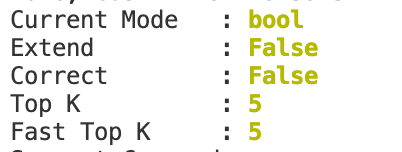
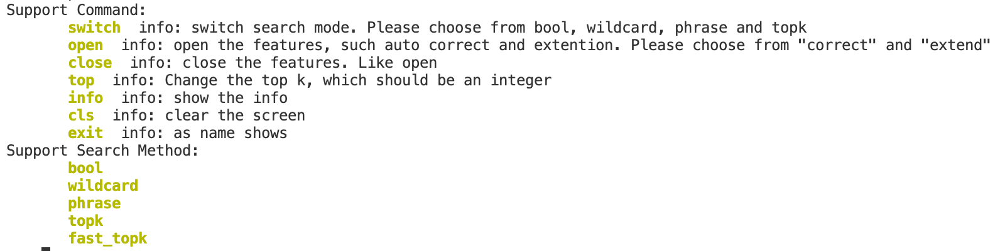
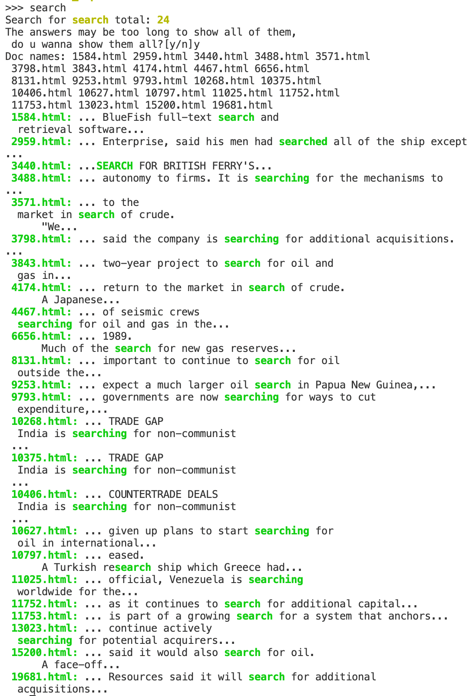

# Web-Search Engine
- language: python

## Usage

```sh
git clone ...
cd $WEBHOME/src 
python console.py
```

before you run  `console.py`, you should check whether the `index` dictionary is complete, it should contain the following files:


if the index dictionary is not complete, you should delete the dictionary and run `console.py`. All the index files wil be created in a few minites.




This table shows the info of the current state. The search mode is bool, the extention and correction function is closed and the k of topk search and fast_topk search are both 5.




This table shows the support command. You can use `:switch mode` to change the search mode    (`bool`,`wildcard`,`phrase`,`topk`,`fast_topk`). 

Method below shows how to use these commands.

### Bool Search

```sh
:switch bool
WORD
```

### Wildcard Search

```sh
:switch wildcard
*search
```

### Phrase Search
```
:switch phrase
to do
```

### Open Correct

```sh
:open correct
saerch 
```

### Open Synonym Extend

```
:open extend
search
```

### Top K
```
:switch topk
search research
```

to change the number of k, use the command

```
:top int
search
```

### Clear the Screen

```
:cls
```

### Show the info

```
:info
```

### Exit the program

```
:exit
```


## Data Structure

### SearchEngine

```python
class SearchEngine:
    def __init__(self) -> None:
        self.state = 0 # 0 for bool, 1 for wildcard search, 2 for phrase search
        self.mode = {
            "bool" : 0,
            "wildcard": 1,
            "phrase": 2,
            "topk": 3,
            "fast_topk":4
        }
        self.command = {
            "switch": self.switch,
            "open": self.open,
            "close": self.close,
            "top": self.change_k, 
            "info": self.info,
            "cls": self.clear,
            "exit": self.exit,
        }
        self.command_info = {
            "switch": "switch search mode. Please choose from bool, wildcard, phrase and topk",
            "open": "open the features, such auto correct and extention. Please choose from \"correct\" and \"extend\"",
            "close": "close the features. Like open",
            "top": "Change the top k, which should be an integer",
            "info": "show the info",
            "cls": "clear the screen",
            "exit": "as name shows"
        }


        self.index = Index()
        self.inverted_index = self.index.inverted_index
        self.doc_dict, self.num_docs = self.index.get_doc()
        self.two_gram_index = self.index.two_gram
        self.vsm = VSM(self.inverted_index, self.num_docs)
        self.top_k = 5
        # print(self.inverted_index['search'])
        self.search_method = [
            lambda command: bool_search(command, self.inverted_index),
            lambda command: wildcard_search(command, self.two_gram_index, self.inverted_index),
            lambda command: phrase_search(command, self.inverted_index),
            lambda command: self.vsm.Top_k_query(command, self.top_k),
            lambda command: self.vsm.Fast_topk_query(command, self.top_k)
        ]

        self.stemmer = Stemmer()

        self.correct = False
        self.extend = False
        pass
```

`state` for current search mode, `mode` for all the search modes

| keys           | Description                                                  |
| -------------- | ------------------------------------------------------------ |
| state          | current search mode                                          |
| mode           | all search modes, 0 for bool, 1 for wildcard search, 2 for phrase search,3 for topk search |
| command        | supporting commands, `switch`, detail in Table methods       |
| inverted_index | as name shows                                                |
| term_dict      | as name shows                                                |
| doc            | as name shows                                                |
| search_method  | function list for  search                                    |
| two_gram_index | index used for wildcard serach                               |
| vsm            | vector space model                                           |

| methods     | description                           |
| ----------- | ------------------------------------- |
| search      | search according to current state     |
| switch      | switch current search mode to another |
| interpreter | analysis the string that user inputs  |

### Inverted Index

The format of the inverse index is as follow:

```python
{
	key1:[
        freq,
        {
            docID1 : [pos1,pos2,....],
            docID2 : [pos1,pos2,....],
        },
    ],
    key2:[
        freq,
        {
            docID1 : [pos1,pos2,....],
            docID2 : [pos1,pos2,....],
        },
    ]
}
...
```

For compress, the format is as follow:

```
key_num,key1_len,key1,key2_len,key2,...
freq1,docID1,pos_num,pos1,pos2-pos1,...docID2-docID1,pos_num,pos1,pos2-pos1,...
freq2,docID2,pos_num,pos1,pos2-pos1,...docID2-docID1,pos_num,pos1,pos2-pos1,...
```

All bytes will number and bytes will convert to VB.

Inverse index is stored in ``II.json II.bit`` in ``.\data``(``II.json`` is stored in the format of json and ``II.bit`` is written to file by pickle), and the compressed inversed index is stored in ``II.bin``

**``II.json`` is to large which cannot be upload to github, if you want to use it, ``Index.WriteII(II,mode='json')`` can generate it。**

To construct and use Index, refer to ``src\Index.py``.

### doc dictionary

```python

{
    docID: docName, 
}

```

This data structure is used to store the map of docID and the filename of each doc.


## Search Result



We support highlight of the searched word.